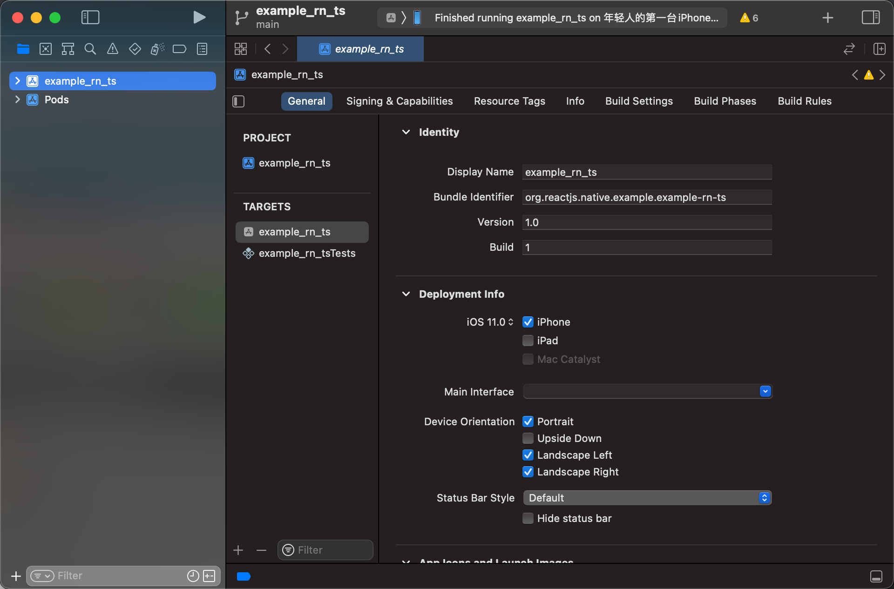

# heart-combo

React Native 心形连击特效

## 演示

待添加

## 开始

### 安装依赖

```bash
# 安装 js 依赖
yarn install

# 安装 iOS 依赖
yarn pod-install

```

### 启动

#### 推荐方式

<details>
<summary>如果你环境都配的非常完美，可以用下面这种方式启动 demo</summary>

```bash
yarn ios
```

</details>

#### xcode

<details>
<summary>点击 “启动scheme到这个设备”，就是上面的那个“播放”按钮(狗头</summary>



</details>
